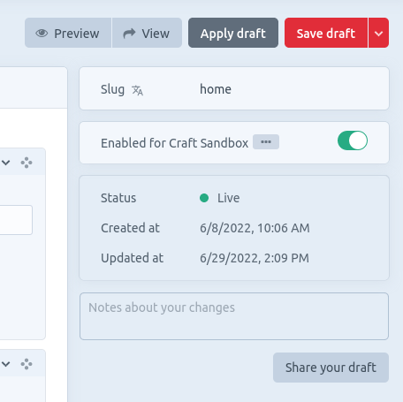
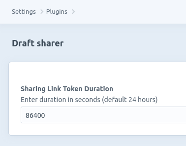

# Draft sharer plugin for Craft CMS 3.x

Plugin to add a link in the CP to share an entry draft

## Requirements

This plugin requires Craft CMS 3.0.0-beta.23 or later.

## Installation

To install the plugin, follow these instructions.

1. Open your terminal and go to your Craft project:

        cd /path/to/project

2. Then tell Composer to load the plugin:

        composer require leeroy/craft-draft-sharer

3. In the Control Panel, go to Settings → Plugins and click the “Install” button for Draft sharer.

## Draft sharer Overview

When you create a draft, a button to generate a share link will appear to the right below the changes note box.

## Configuring Draft sharer

The sharing link will be usable for 24 hours, but you can change it in the plugin settings.

## Draft sharer Roadmap

Some things to do, and ideas for potential features:

* Add a permission to access the "Share your draft" feature
* Exclude list of sections by handle
* Make some unit test

Brought to you by [Leeroy agency](https://github.com/Leeroy-agency)
